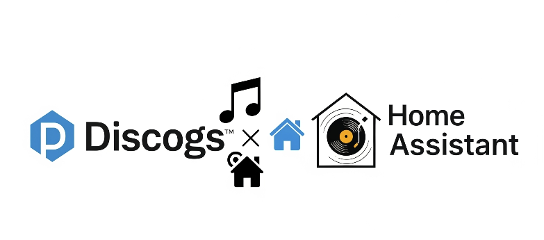
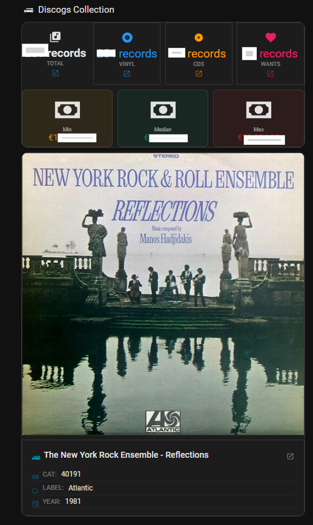

## Home Assistant Discogs Enhanced Integration


[](https://my.home-assistant.io/redirect/hacs_repository/?owner=andreasc1&repository=homeassistant-discogs-enhanced&category=integration)

This custom integration for Home Assistant provides enhanced monitoring of your Discogs collection, building upon the official Discogs integration. Track your collection size, wantlist, format counts, and the estimated **minimum, median, and maximum market value** of your vinyl and CD collection.

### Why this Integration?

The official Home Assistant Discogs integration covers collection and wantlist counts and random record suggestions — but offers no insight into monetary value or format breakdowns. This integration adds exactly that:

* **Collection Value (Minimum/Median/Maximum):** Estimated market value sensors with dynamic currency detection based on your Discogs account settings.
* **Format Counts:** Separate sensors for the number of Vinyl records and CDs in your collection.

This project is heavily based on and inspired by the [official Home Assistant Discogs integration](https://www.home-assistant.io/integrations/discogs) originally developed by **[@thibmaek](https://github.com/thibmaek)**.

**A Note on Development:** As someone without extensive development experience, this integration was brought to life with significant assistance from AI models, which helped in understanding Home Assistant's architecture, refactoring the code, and implementing new features.

---

### Requirements

* Home Assistant 2023.1 or later
* A [Discogs personal access token](https://www.discogs.com/settings/developers)

---

### Installation

This integration is available through HACS (Home Assistant Community Store).

1. **Add this repository to HACS:**
   * Open HACS in your Home Assistant instance.
   * Go to **Integrations**.
   * Click the **three dots** in the top right corner and select **Custom repositories**.
   * Enter the URL: `https://github.com/andreasc1/homeassistant-discogs-enhanced`
   * Select **Category**: `Integration`.
   * Click **ADD**.
2. **Install the integration:**
   * Navigate back to the HACS **Integrations** tab.
   * Search for **Discogs Enhanced Integration**.
   * Click **Download** and select the latest version.
3. **Restart Home Assistant.**

---

### Configuration

It is strongly recommended to store your Discogs token in `secrets.yaml` rather than directly in `configuration.yaml`.

**`secrets.yaml`:**
```yaml
discogs_token: YOUR_DISCOGS_API_TOKEN
```

**`configuration.yaml`:**
```yaml
sensor:
  - platform: discogs_enhanced
    token: !secret discogs_token
    name: My Discogs Collection  # Optional, defaults to "Discogs"
    monitored_conditions:
      - collection
      - wantlist
      - random_record
      - collection_value_min
      - collection_value_median
      - collection_value_max
      - vinyl_count
      - cd_count
```

---

### Sensors

| Sensor | Description |
|--------|-------------|
| `sensor.discogs_enhanced_collection` | Total number of releases in your collection |
| `sensor.discogs_enhanced_wantlist` | Total number of items in your wantlist |
| `sensor.discogs_enhanced_random_record` | A random record from your collection with artist, title, label, format, and cover image attributes |
| `sensor.discogs_enhanced_collection_value_min` | Estimated minimum market value of your collection |
| `sensor.discogs_enhanced_collection_value_median` | Estimated median market value of your collection |
| `sensor.discogs_enhanced_collection_value_max` | Estimated maximum market value of your collection |
| `sensor.discogs_enhanced_vinyl_count` | Number of Vinyl records in your collection |
| `sensor.discogs_enhanced_cd_count` | Number of CDs in your collection |

---
Visual outcome / Cards:

---


### Changelog

#### v1.1.0 — Security Hardening
- Migrated to fully async setup; blocking API calls dispatched to executor
- API token no longer stored in shared state; masked in all log output
- Switched from `requests` to HA's built-in `aiohttp` with explicit TLS verification and timeouts
- Collection value parsing fixed (removed erroneous ×1000/÷1000 arithmetic)
- Cover image URLs validated against a trusted Discogs CDN allowlist
- Financial data downgraded from INFO to DEBUG log level
- Fixed invalid JSON in `hacs.json`

#### v1.0.0 — Initial Release
- Collection, wantlist, and random record sensors
- Collection value (min, median, max) sensors
- Vinyl and CD format count sensors

---

### Support & Contributions

If you encounter any issues or have suggestions, please open an issue on the [GitHub Issue Tracker](https://github.com/andreasc1/homeassistant-discogs-enhanced/issues).

Contributions are welcome — feel free to fork the repository and submit pull requests.
